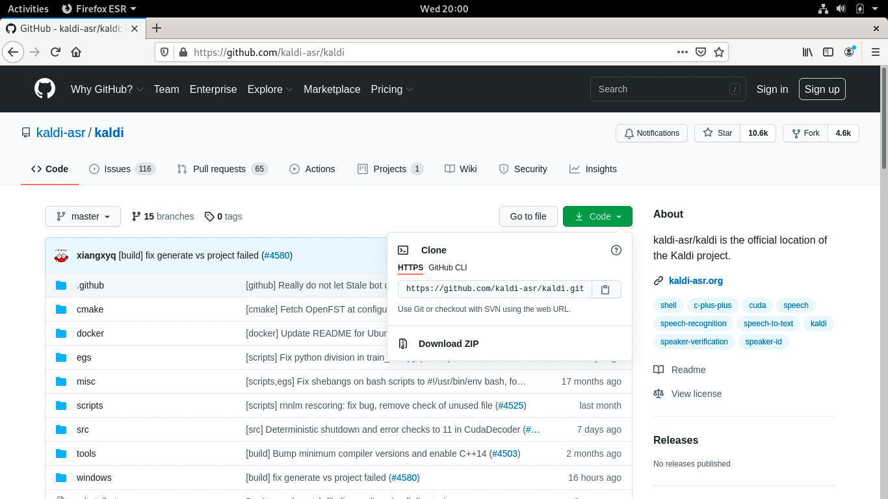
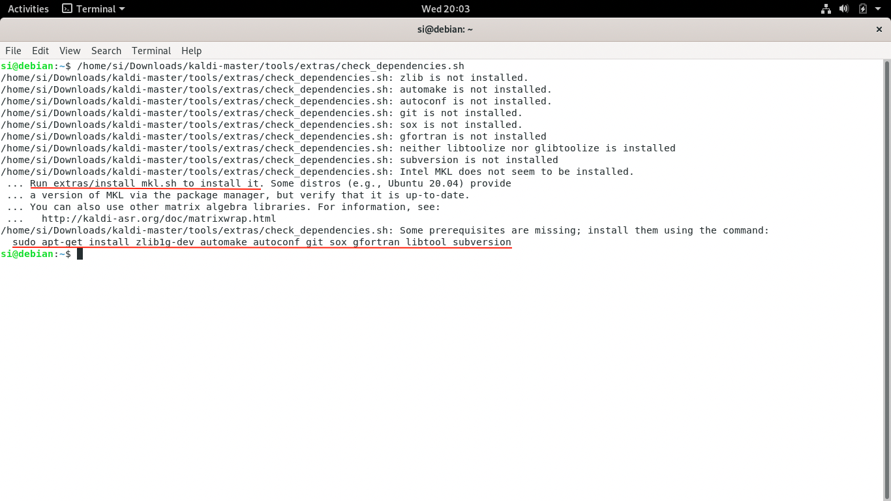
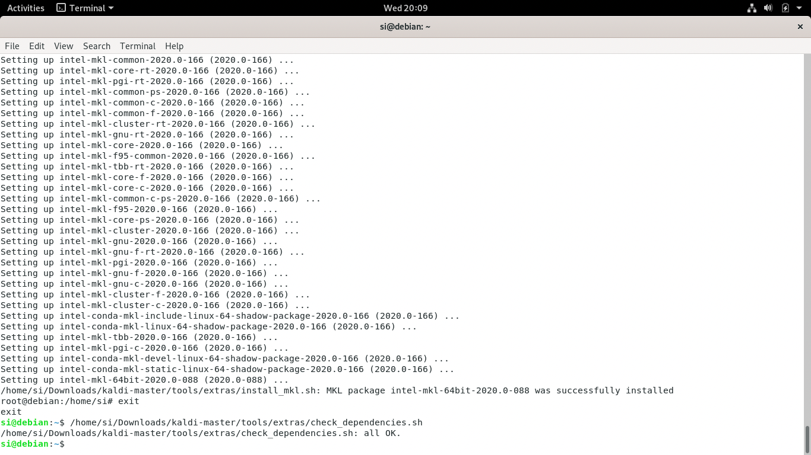
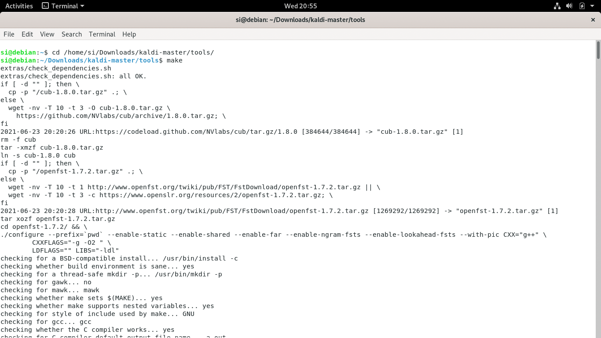
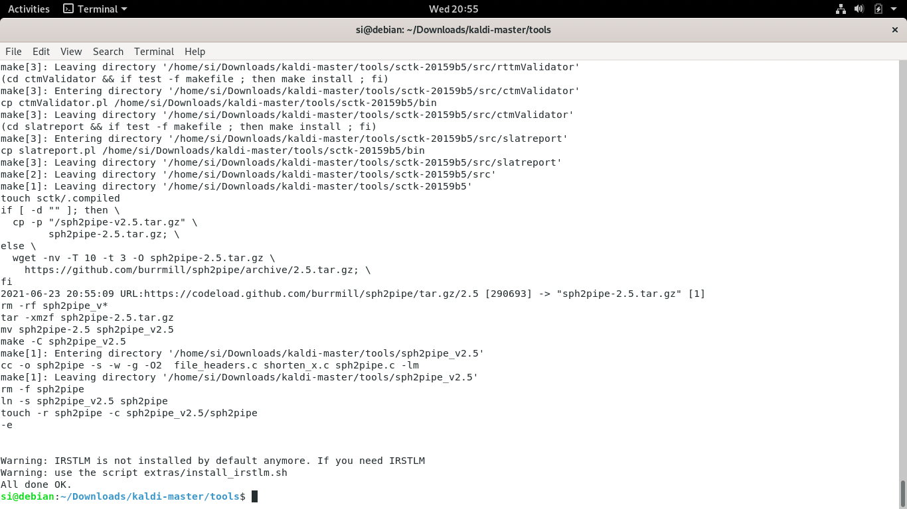

# Install Kaldi
## Get the tool kit
 First, we need to install [Kaldi](https://github.com/kaldi-asr/kaldi), an open-source speech-recoginition toolkit that's required by MFA.
 Download the files and extract them to a directory you want to keep them in:

 

 As shown in the INSTALL file, there are two ways to installing Kaldi. Here, let's go with the first option.

 INSTALL file:

	This is the official Kaldi INSTALL. Look also at INSTALL.md for the git mirror installation.
	[Option 1 in the following does not apply to native Windows install, see windows/INSTALL or following Option 2]

	Option 1 (bash + makefile):

	  Steps:
		(1)
		go to tools/  and follow INSTALL instructions there.

		(2)
		go to src/ and follow INSTALL instructions there.

	Option 2 (cmake):

		Go to cmake/ and follow INSTALL.md instructions there.
		Note, it may not be well tested and some features are missing currently.

 ## Installation at tools/
 First, we need to follow the installation instrcution in **tools/**.

 tools/INSTALL file:

	To check the prerequisites for Kaldi, first run

	  extras/check_dependencies.sh

	and see if there are any system-level installations you need to do. Check the
	output carefully. There are some things that will make your life a lot easier
	if you fix them at this stage. If your system default C++ compiler is not
	supported, you can do the check with another compiler by setting the CXX
	environment variable, e.g.

	  CXX=g++-4.8 extras/check_dependencies.sh

	Then run

	  make

	which by default will install ATLAS headers, OpenFst, SCTK and sph2pipe.
	OpenFst requires a relatively recent C++ compiler with C++11 support, e.g.
	g++ >= 4.7, Apple clang >= 5.0 or LLVM clang >= 3.3. If your system default
	compiler does not have adequate support for C++11, you can specify a C++11
	compliant compiler as a command argument, e.g.

	  make CXX=g++-4.8

	If you have multiple CPUs and want to speed things up, you can do a parallel
	build by supplying the "-j" option to make, e.g. to use 4 CPUs

	  make -j 4

	In extras/, there are also various scripts to install extra bits and pieces that
	are used by individual example scripts.  If an example script needs you to run
	one of those scripts, it will tell you what to do.

We need to first check the whether the dependencies are installed in the system. Open the terminal application on your system, for example, Terminal in macOs/Linux or cmd.exe in Windows, and run ```extras/check_dependencies.sh```. You might see something like this:



**TIP:**
In macOS and Linux, you can drag the file to the Terminal window to input the directory of the file so that you don't need to type the directory!

Here, the script tells me that I need to run the two commands underlied in the screenshot to install the dependencies. After you run these commands from the output, try run ```extras/check_dependencies.sh``` again. Then you should see the script telling you
"all OK"!



Now we can run the ```make``` command. Note that it can take a long time.




Now that we're done with the work in **tools/**, we can move on to **src/**

## Installation at src/
Run the three commands listed in the **INSTALL** file. Again, the installation here might take a long time. Then Kaldi will be installed on your computer.

/src/INSTALL files:

	These instructions are valid for UNIX-like systems (these steps have
	been run on various Linux distributions; Darwin; Cygwin).  For native Windows
	compilation, see ../windows/INSTALL.

	You must first have completed the installation steps in ../tools/INSTALL
	(compiling OpenFst; getting ATLAS and CLAPACK headers).

	The installation instructions are

	  ./configure --shared
	  make depend -j 8
	  make -j 8

	Note that we added the "-j 8" to run in parallel because "make" takes a long
	time.  8 jobs might be too many for a laptop or small desktop machine with not
	many cores.

	For more information, see documentation at http://kaldi-asr.org/doc/
	and click on "The build process (how Kaldi is compiled)".
