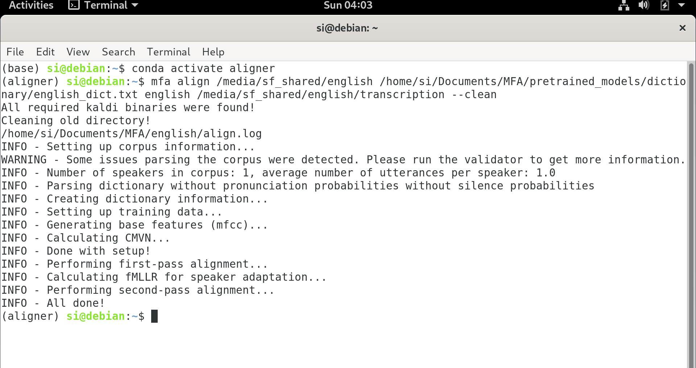
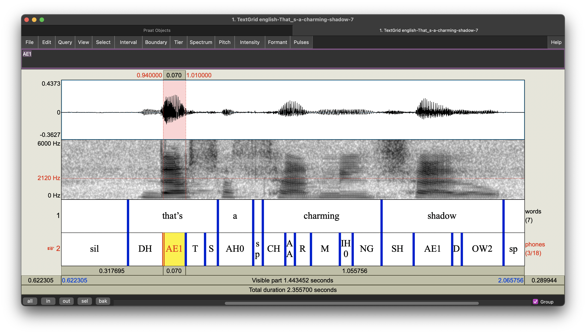

# Start with a single recording

This section shows how to align an transcript with MFA.

## 1. Create the transcript

Each audio file needs to be accompanied by a text file or a .textgrid file which includes its transcript. If you use a text file, it should have the same name as the audio with suffixes '.txt' or '.lab'. In the text file:

1. **ALL** the sounds in the recording should be transcribed;
2. all the letters should be in upper case;
3. all the punctuation marks should be removed.

For example, if you have a audio files named 'test.wav', you'll also need a transcript in the same directory named 'test.txt' or 'text.lab'.

### 1.1. If you don't have the transcript

Fret not! At a time when your phone can push personalized ads according to what it hears you say, there are many tools that are available for automatic transcription. You can feed your audio to the dictation function on your computer, but it's very slow. MFA has a 'transcribe' function, but I haven't had much success with it. So I'll introduce you with some other tools.

The [BAS Web Service](https://clarin.phonetik.uni-muenchen.de/BASWebServices/interface) has the Automatic Speech Recognition (ASR) tool among its wide range of phonetic processing tools. It's free for academic purposes and very easy to use. You just need to upload the audio files and fill in a few options on a webpage, then it will send the audio to a third-party ASR service and return the transcripts.

[DeepSpeech](https://github.com/mozilla/DeepSpeech) is an open-source speech-text-engine. You can use it offline with pre-trained models. I have [a short script](Batch_processing?id=11-transcribing-recordings-for-recordings-with-different-content-with-deepspeech) for transcribing audio files in batch.

There are also some commercial ASR services you can try. Here are some links:
- [Amazon Transcribe](https://aws.amazon.com/transcribe/)
- [Google Cloud](https://cloud.google.com/speech-to-text)
- [IBM Watson](https://www.ibm.com/cloud/watson-speech-to-text)
- [Microsoft Azure](https://azure.microsoft.com/en-us/services/cognitive-services/speech-to-text/)

Note that in phonetic experiments the content in the recordings is often not common in normal speech, so the automatic transcription might make a lot of mistakes. It is necessary to manually correct the resutls.

## 2. Make sure all the words are in the dictionary

The dictionary entries are in the format [word] [phonetic transcription]. Just like in the transcript, all the letters are in upper case. The transcription is encoded with 2-letter [ARPABET](https://en.wikipedia.org/wiki/ARPABET).

Some entries from the LibriSpeech lexicon:
```
ACORN  EY1 K AO0 R N
ACORNS  EY1 K AO0 R N Z
ACOSTA  AH0 K AO1 S T AH0
ACOTA	AH0 K OW1 T AH0
ACOUNT	AH0 K UW1 N T
ACOUSTIC  AH0 K UW1 S T IH0 K
ACOUSTICAL  AH0 K UW1 S T IH0 K AH0 L
ACOUSTICS  AH0 K UW1 S T IH0 K S
ACOYAPO	AH0 K OY0 AA1 P OW0
ACQUA	AE2 K W AH0
```

If the dictionary doesn't have some words or non-words in the recording, you can add the entry to the dictionary. For example:
```
PENICILLIN	P EH2 N AH0 S IH1 L IH0 N
```

## 3. Validate the data (optional)

After you've prepared the data, you can run the validate command to check if there's any problem.
```
mfa validate corpus_directory dictionary_path [optional_acoustic_model_path]
```
This step isn't necessary. But when you run into some errors, this command is useful for checking what exactly the issues are.

## 4. Run the alignment

Switch to the conda environment with MFA with ```conda activate aligner```('aligner' is the name of the environment with MFA). Use the command ```mfa align corpus_directory dictionary_path acoustic_model_path output_directory``` to run the alignment. There are some options you can specify with this command. For example, adding ```--clean``` to the end of the command tells the machine to remove the temporary files before alignment. The temporary files store dataset-specific information. They should be cleaned when you align data from different speakers but stored in a folder with the same name as any previously aligned dataset. On my computer, the process looks like this:


Then the .textgrid files with aligned transcripts should appear in the output_directory. This is what I got:


## 5. Check the results

If the .textgrid files are well aligned, congratulations! But the aligner can produce bad results in some cases. The most common causes for alignment errors are noises and speech errors in the recording. It's often easier to make some adjustments to the files and rerun the alignment than to manually correct the results. Depending on your situation, you might want to edit the audio (e.g., cutting out the noises/errors) or edit the transcript (e.g., marking the noises/errors). For example, in some phonetic experiment recordings, the sound of keyboard strokes can interfere with the the alignment. You can add an entry like ```KEYBOARDNOISE D``` (representing the keyboard sound with /d/) to the dictionary and add 'KEYBOARDNOISE' in the transcript whenever there's a key stroke.

[Last update: Jul 15, 2021]
